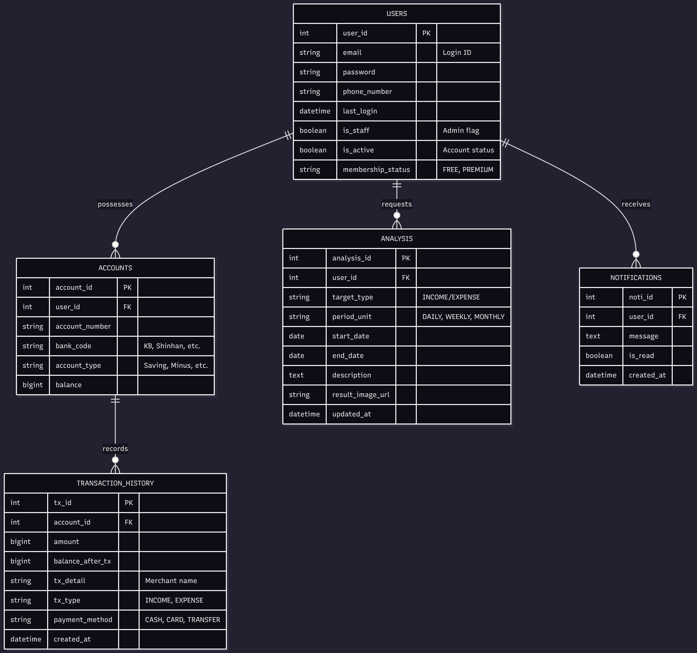
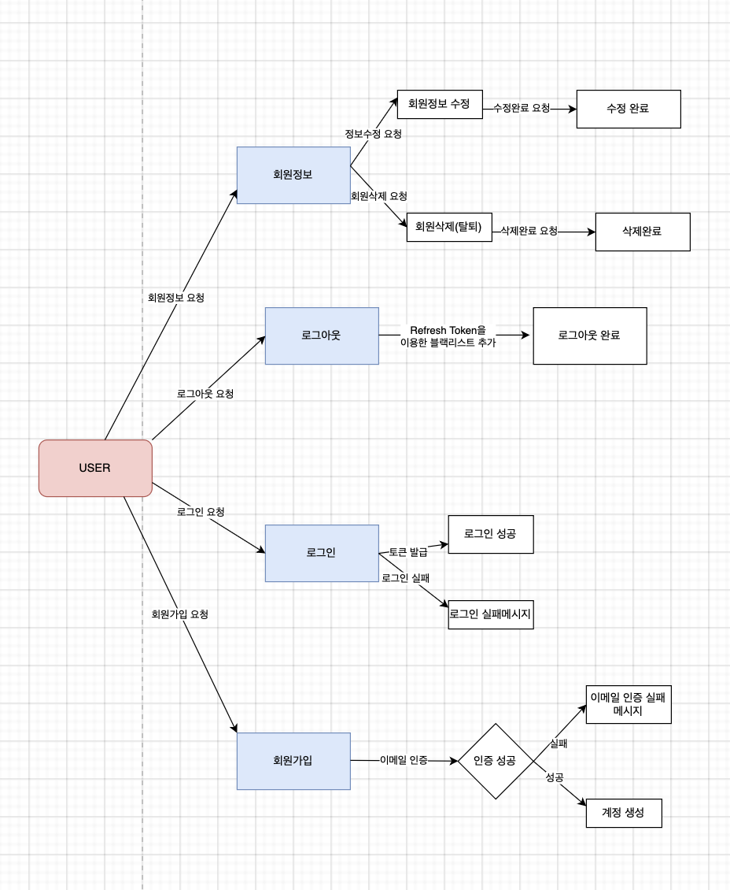

## ERD

본 프로젝트는 사용자(User), 계좌(Account), 거래(Transaction) 정보를 관리하기 위한 구조로 설계되었습니다.

- User : 서비스 이용자 정보 관리
- Account : 사용자의 은행 계좌 정보 (1:N)
- Transaction : 계좌별 입출금 거래 내역 (1:N)

## flowchart

본 프레적트는 회원가입, 로그인, 로그아웃, 회원정보를 시각적으로 이해하고 시스템 흐름을 알기 위해 설계되었습니다.

- 회원가입 : 사용자가 회원가입을 요청을 하면, 이메일 인증을 통해 계정이 생성되거나, 인증 실패 시에는 메일 인증 실패 메시지가 반환됩니다.
- 로그인 : 사용자가 로그인을 하면 로그인 요청 후 토큰이 발급되고, 로그인 성공이나 실패 시 메시지가 반환됩니다.
- 로그아웃 : 사용자가 로그아웃을 하면 Refresh Token을 통해 블랙리스트에 추가되고 로그아웃 완료 메시지를 반환합니다.
- 회원정보 : 사용자가 자신의 정보를 확인,수정,삭제를 요청할 수 있고 수정을 완료하거나, 정보를 삭제할 경우 완료 메시지를 반환합니다.

