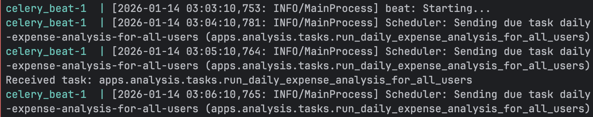

# 💰 Rich Makers – Django 가계부 프로젝트

개인 사용자를 위한 **가계부 및 소비 분석 서비스**입니다.  
거래 내역 관리부터 기간별 소비 분석, 비동기 처리(Celery), 알림 시스템까지 구현하며  
**Django 실무형 백엔드 아키텍처**를 학습·적용하는 것을 목표로 한 프로젝트입니다.

---

## 🎯 프로젝트 목표

- Django 기반 REST API 설계 및 구현
- 앱 단위 책임 분리 (Users / Accounts / Transactions / Analysis / Notifications)
- Docker 기반 개발 환경 구성
- 비동기 작업(Celery) 및 정기 스케줄링(Celery Beat)
- ERD 및 인증 흐름 기반 설계 문서화
- 테스트 코드 기반 개발 경험

---

## ✨ 주요 기능

### 👤 사용자 (Users)
- 회원가입 (이메일 인증)
- 로그인 / 로그아웃 (토큰 기반 인증)
- 회원정보 조회 / 수정 / 삭제(탈퇴)

### 🏦 계좌 (Accounts)
- 사용자별 계좌 관리

### 💸 거래 내역 (Transactions)
- 계좌별 수입 / 지출 관리
- 거래 유형, 금액, 날짜, 결제 수단 관리

### 📊 소비 분석 (Analysis)
- 기간별 (Daily / Weekly / Monthly) 소비 분석
- 수입 / 지출 유형별 분석
- 분석 로직 분리 (Analyzer)
- 비동기 분석 처리 (Celery Task)
- 분석 결과 저장 및 알림 생성

### 🔔 알림 (Notifications)
- 분석 완료 알림
- 사용자별 알림 조회
- 읽음 / 안읽음 상태 관리

---

## 🧱 기술 스택

| 구분 | 기술 |
|---|---|
| Backend | Django, Django REST Framework |
| Database | PostgreSQL |
| Async | Celery, Celery Beat |
| Docs | drf-spectacular (Swagger/OpenAPI) |
| Infra | Docker, Docker Compose |
| Test | Django TestCase |
| Dev Tool | pre-commit, Ruff |
| Config | settings 분리 (base / dev / prod) |

---

## 🗂️ 프로젝트 구조

```bash
rich-makers/
├── apps/
│   ├── accounts/
│   ├── analysis/
│   │   ├── analyzers.py
│   │   ├── tasks.py
│   │   ├── serializers.py
│   │   ├── views.py
│   │   └── tests/
│   ├── notifications/
│   │   ├── models.py
│   │   ├── serializers.py
│   │   ├── views.py
│   │   └── tests/
│   ├── transactions/
│   │   ├── models.py
│   │   ├── serializers.py
│   │   ├── views.py
│   │   └── tests.py
│   └── users/
│       ├── models.py
│       └── constants.py
│
├── config/
│   ├── settings/
│   │   ├── base.py
│   │   ├── dev.py
│   │   └── prod.py
│   ├── celery.py
│   ├── urls.py
│   ├── asgi.py
│   └── wsgi.py
│
├── docs/
│   ├── erd.png
│   └── flowchart.png
│
├── docker-compose.dev.yml
├── Dockerfile
├── manage.py
├── pyproject.toml
└── README.md
```
---

## 🧩 ERD (Entity Relationship Diagram)

본 프로젝트는 **사용자(User)**, **계좌(Account)**, **거래(Transaction)**, **분석(Analysis)**, **알림(Notification)** 정보를 관리하기 위한 구조로 설계되었습니다.

### 핵심 엔티티

- **User**: 서비스 이용자 정보 관리
- **Account**: 사용자의 은행 계좌 정보 (**User : Account = 1 : N**)
- **Transaction (Transaction History)**: 계좌별 입출금 거래 내역 (**Account : Transaction = 1 : N**)
- **Analysis**: 사용자가 요청한 소비 분석 정보 (기간 및 유형별 분석 결과 저장)
- **Notification**: 분석 완료 및 시스템 이벤트 알림 (사용자별 알림 관리)

### 📌 ERD Diagram


---
## 🔐 Authentication Flow

회원가입, 로그인, 로그아웃, 회원정보 관리를
시스템 흐름 관점에서 명확히 이해할 수 있도록 설계되었습니다.

### 회원가입
- 회원가입 요청
- 이메일 인증
- 인증 성공 → 계정 생성
- 인증 실패 → 실패 메시지 반환

### 로그인
- 로그인 요청
- 인증 성공 → Access / Refresh Token 발급
- 인증 실패 → 실패 메시지 반환

### 로그아웃
- 로그아웃 요청
- Refresh Token 블랙리스트 처리
- 로그아웃 완료

### 회원정보
- 회원정보 조회 / 수정 / 삭제(탈퇴)

### Authentication Flow Diagram


---

## ⏰ Celery Beat 스케줄링 (정기 분석)

본 프로젝트는 **Celery Beat**를 사용하여  
**모든 사용자에 대한 일별 지출 분석 작업을 정기적으로 자동 실행**하도록 구성했습니다.

### ✅ 스케줄링 목적

- 사용자가 요청하지 않아도 **매일 자동으로 지출 분석**이 수행되도록 배치 작업을 구성
- 분석 결과를 저장하고, 필요 시 **알림(Notification)**까지 확장 가능한 구조

---

### 🧠 동작 흐름

```text
Celery Beat (Scheduler)
 → daily-expense-analysis-for-all-users (주기적 트리거)
   → Celery Worker
     → run_daily_expense_analysis_for_all_users 실행
       → 사용자 목록 조회
       → 사용자별 지출 분석 수행
       → Analysis 결과 저장/업데이트
       → (선택) Notification 생성
```
### 🖼️ 실행 로그 



---

## 📘 API 문서 (Swagger)
- Swagger UI
http://localhost:8000/api/schema/swagger-ui/

---

## 🚀 실행 방법


---
## 📄 License

This project is licensed under the **MIT License**.

---
## 👩‍💻 Developers 

- **[@dotory-60](https://github.com/dotory-60)**: User·Transaction 기능 구현 및 프로젝트 전반 환경 설정
- **[@Ryu_GY](https://github.com/Ryu_GY)**: 모델 설계, Analysis·Notification 기능 구현
- **[@schicksal36](https://github.com/schicksal36)**: API 스펙 설계
